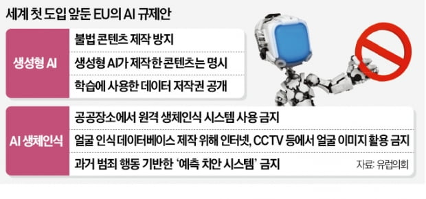

## 인공지능 규제 법안 유럽의회 통과

 

> 14일(현지시간) 유럽의회는 본회의 표결에서 EU 전역에서 AI를 규제하기 위한 법안 협상안이 찬성 499표, 반대 28표, 기권 93표로 가결됐다고 발표했다. 
>
> 의회는 이날 EU 집행위원회와 27개국을 대표하는 EU 이사회 간 3자 협상에 들어간다고 밝혔다. 
>
> 3자 협상은 EU가 새로운 법안을 시행하기 전 거쳐야 하는 최종 관문이다.

 

 

### 주요 규제안

1. #### 생성형 AI

   1. OpenAI와 Google 등 **생성형 AI**를 운영하는 기업들은 **위험성을 판단하는 평가**를 받아야 한다.

   2. AI 챗봇이 **불법적인 콘텐츠를 생성하지 않도록 관리**해야 한다.

   3.  AI가 만든 콘텐츠는 이 사실을 알려야 하며, AI가 **학습한 데이터의 저작권을 공개**해야 한다.

      => 데이터 저작권을 가진 이들이 AI 개발 기업에 수익 공유나 데이터 사용료를 요구하게 될수도..?

2. #### AI 생체 인식

   1.  AI를 활용한 안면 인식 등 **원격 생체 인식을 전면 금지** 

      > 아동에게 위험한 행동을 유발하는 음성 활성화 장난감과 같은 **'인지 행동 조작'**, 
      > 사회 경제적 지위 또는 개인적 특성 등에 기반한 사람들의 분류인 **'사회적 점수화'**,
      > 얼굴 인식과 같은 **'실시간 및 원격 생체 인식 시스템'**  등

      => 범죄와 관련된 원격 생체 인식시스템 등은 일부 예외가 허용되지만, 법원의 승인이 있어야 한다.

 

> EU가 2년간 준비한 AI 규제 법제화가 가까워짐에 따라, 유럽은 미국 실리콘밸리 기업들이 주도하는 AI 산업에 영향력을 행사할 수 있게 됐다. 
>
> 그동안 오픈AI, 마이크로소프트(MS), 구글 등 미국 기술 기업들은 AI 규제가 필요하다는 주장을 선제적으로 펼쳐왔다. 
>
> 챗GPT의 개발사인 오픈AI 샘 올트먼 최고경영자(CEO)는 “국제원자력기구(IAEA) 같은 국제 기구를 만들어 AI를 규제하자”고 주장해왔고, 오픈AI의 핵심 투자자인 MS 역시 “정부 주도의 AI 가드레일이 필요하다”(브래드 스미스 MS 부회장)는 의견을 피력했다.
>
> > 이들의 ‘규제 옹호’엔 경쟁의 규칙을 유리한 방향으로 끌고 가려는 의도도 있다.
> >
> > 규제의 방향과 수준이 이들 선두주자들의 수준에 맞춘다면, AI 후발주자들은 추격하기가 쉽지 않기 때문이다.
> >
> > 이 때문에 이들의 주장이 ‘AI 사다리 걷어차기’라는 비판이 나온다. 
> >
> > AI 규제를 꾸준히 강조하던 샘 올트먼 오픈AI CEO는 지난 5일 이스라엘 방문에서 “AI에 당장 무거운 규제를 가해 혁신을 늦추는 것은 실수라고 생각한다”며 강도 높은 규제엔 반대한다며 애매한 태도를 보였다.
> >
> > 유럽이 강경한 규제를 예고하자, 지난달 24일 영국 방문 당시 “규제가 심하면 유럽에서 GPT 운영을 중단할 수 있다”고 했다가 이틀 만에 번복하기도 했다. 
> >
> > 그러면서도 물밑에선 부지런히 EU 리더들을 설득했다.
> >
> > EU의 로비스트 명부인 투명성 등록부에 따르면, 15일 기준 오픈AI 관련자들은 올해에만 EU집행위원회와 3차례의 만남을 가진 것으로 나타났다.

 

EU는 연말 내 3자 협상 타결을 목표로 하고 있다. 계획대로 진행되더라도 유예 기간 등을 고려하면 실제 규제가 적용되는 시점은 2026년께가 될 전망이다.

법안이 최종 확정되면 이를 어긴 기업은 총 연매출의 6%에 육박하는 벌금을 부과받을 수 있다.

 

 

## 참고 기사

https://www.eroun.net/news/articleView.html?idxno=33543

https://www.hankyung.com/international/article/2023061526531

https://www.joongang.co.kr/article/25170287#home

https://www.yna.co.kr/view/AKR20230614165000098