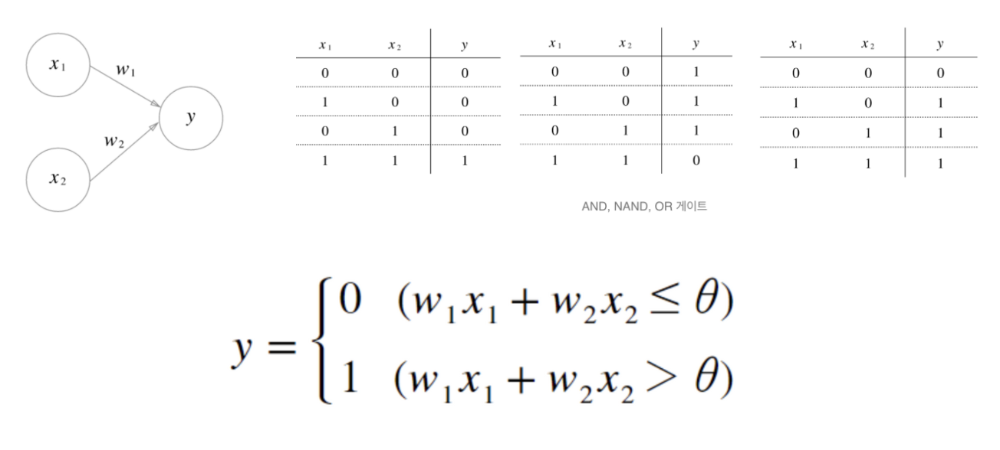
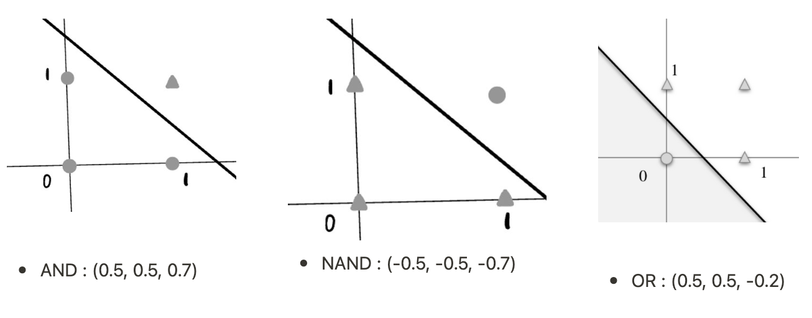
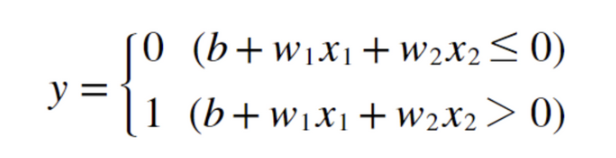
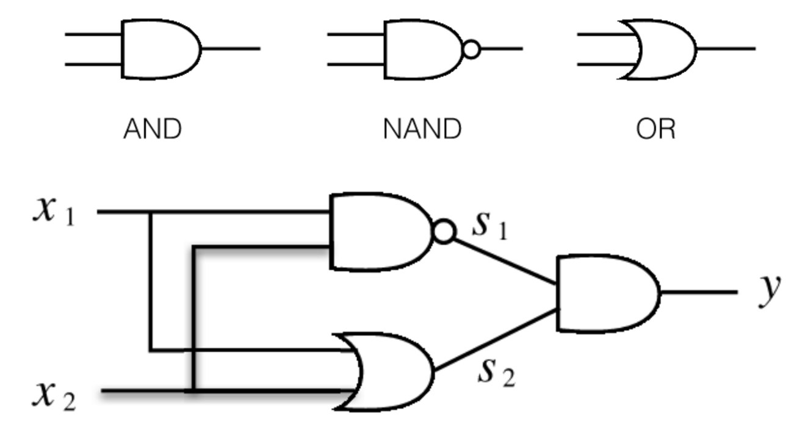
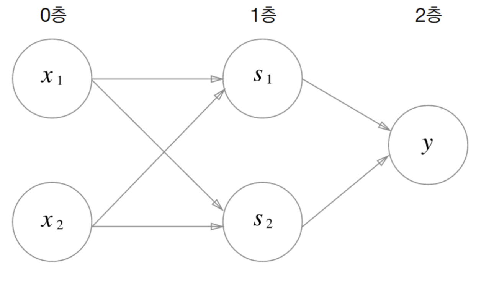
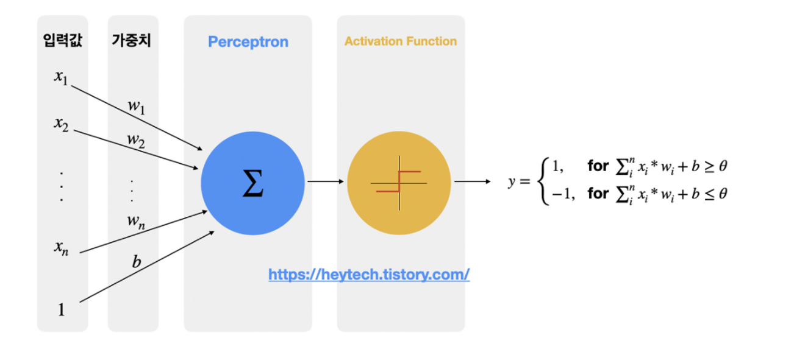
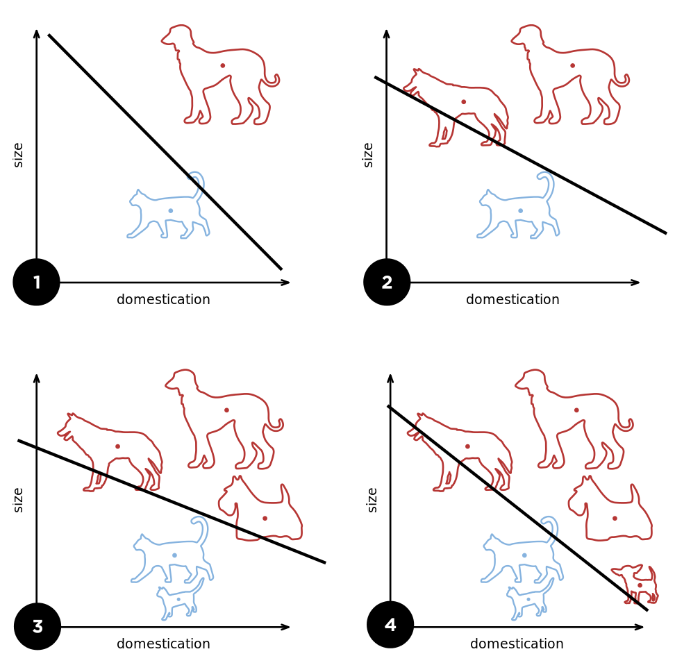

### TL;DR

- 퍼셉트론은 입출력을 갖춘 알고리즘이다.
- 퍼셉트론은 가중치와 편향을 매개변수로 갖는다.
- 퍼셉트론으로 AND, OR, NAND 등 논리 회로를 표현할 수 있다.
- 하지만 XOR 게이트는 단층 퍼셉트론으로는 표현할 수 없다.
- 2층 퍼셉트론을 사용하면 XOR 게이트 뿐 아니라 이론상 컴퓨터도 표현할 수 있다.

<br />

## 퍼셉트론 Perceptron

### 1. 퍼셉트론이란?

**퍼셉트론은** 프랑크 로젠블라트 (Frank rosenblatt)가 1957년 고안한 신경망(딥러닝)의 기원이 되는 **알고리즘이다.** Perceptron은 Perception과 neuron의 합성어로 인공 뉴런이라고도 부른다. 생물학적인 신경계(Neural Network)의 기본 단위인 신경세포(Neuron)의 동작 과정을 통계학적으로 모델링한 알고리즘이다.

> 👆 **여기서 잠깐!** 
> 프로그래밍에서 알고리즘이란 input 값을 통해 output 값을 얻기 위한 계산 과정을 의미하는데, 퍼셉트론 또한 입출력을 갖췄기 때문에 알고리즘으로 볼 수 있다.

**⇒ 퍼셉트론은 다수의 입력값을 받아 하나의 값으로 출력하는 알고리즘이다.**

<br />

<br />

### 2. 퍼셉트론 예시

#### **AND / NAND / OR 게이트**



입력을 2개 갖는 퍼셉트론이 있을 때 ($w_1,\ w_2,\ \theta$) 을 적절히 설정해 각 게이트들을 구성할 수 있다.

<br />



<br />

#### **CODE**



```python
def AND(x1, x2) :
		x = np.array([x1, x2])
		w = np.array([0.5, 0.5])
		b = -0.7
		tmp = np.sum(w * x) + b
		if tmp <= 0 :
				return 0
		else :
				return 1
```

<br />

**⇒ 예시에서는 퍼셉트론의 매개변수 값을 직접 정했지만 기계학습에서는 이 매개변수의 값을 정하는 작업을 컴퓨터가 자동으로 하도록 한다.**

<br />

<br />

### 3. 퍼셉트론의 종류

위의 예시처럼 입력층과 출력층만 있는 퍼셉트론을 단층 퍼셉트론이라고 한다. 단층 퍼셉트론은 직선 하나로 나눈 영역만 표현할 수 있다는 한계가 있다. 따라서 XOR 게이트를 만들 수 없다.


NAND, AND, OR 게이트를 쌓아 XOR 게이트를 구현하는 것처럼 퍼셉트론을 쌓아 다층 퍼셉트론을 만들어 XOR을 표현할 수 있다.

<br/>



```python
def XOR(x1, x2) :
		s1 = NAND(x1, x2)
		s2 = OR(x1, x2)
		y = AND(s1, s2)
		return y
```

<br />



**⇒ 단층 퍼셉트론은 직선 영역만 표현할 수 있고, 다층 퍼셉트론은 비선형 영역도 표현할 수 있다. 이론상 2층 퍼셉트론이면 컴퓨터를 만들 수 있다!**

<br /><br />

### 4. 퍼셉트론의 동작 과정

생물학 관점에서 뉴런은 인접한 뉴런과 다양한 신호를 주고 받으며 정보를 얻거나 저장하는 역할을 한다. 뉴런이 저장한 신호의 크기가 특정 값(=임계값) 이상이 되면 신호가 외부로 전달된다.



- 퍼셉트론은 뉴런이 다른 뉴런으로부터 신호를 입력받듯 다수의 값 $x$을 입력받고, 입력된 값마다 가중치($weight$)를 곱한다.
- 여기서 **가중치**는 생물학 뉴런에서 뉴런 간 시냅스를 통한 결합의 세기와 같은 역할이며 가중치가 **클수록 입력값이 중요하다는 것을 의미**한다.
- 뉴런은 **임계값**(theta, $\theta$) 보다 클 때 신호를 출력한다. 즉 임계값은 뉴런이 얼마나 쉽게 활성화 하느냐를 정하는 역할이며 임계값이 **클수록 해당 뉴런의 값이 외부로 전달되기 어렵다**는 것을 의미한다.

<br /><br /><br />

### 5. 퍼셉트론 자동 학습하기

임의로 설정된 가중치(weight) 값에서 시작해 모든 학습 데이터를 제대로 분류하도록 가중치 값을 개선한다. 



<br />

<br />

<br />

# Ref

- https://m.blog.naver.com/gaussian37/221069835408

- https://heytech.tistory.com/332

- https://en.wikipedia.org/wiki/Perceptron

  