# 신경망

## 3.1 퍼셉트론에서 신경망으로

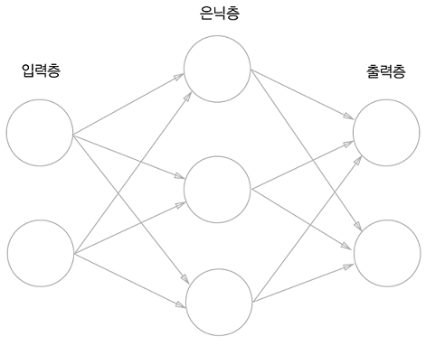

퍼셉트론은 가중치 매개변수를 사람이 수동으로 설정해야한다.

신경망은 가중치 매개변수의 적절한 값을 데이터로부터 자동으로 학습한다.

<br/>

## 1. 신경망 예시


위의 그림은 **_입력층_**, **_은닉층_**, **_출력층_**으로 구성된 신경망이다.

신경망의 층을 셀때, 일반적으로 가중치를 갖는 층의 개수를 세어 **2층 신경망**이라고 부른다.

<br/>

<br/>

## 2. 활성화 함수란?

퍼셉트론의 동작을 식으로 정리하면 다음과 같다.

> $$
> y = h(b + w_1x_1 + w_2x_2) \newline
> $$
>
> $$
> h(x) =
> \begin{cases}
> \ \ 1 & ( x \ > \ 0 ) \\
> \\
> \ \ 0 & ( x \ \leq \ 0 ) \\
> \end{cases}
> $$
>
> $$
> (b : \text{편향},  \  w_i : \text{가중치},  \ x_i : \text{입력값})
> $$

이때, $h(x)$를 **활성화 함수(activate function)** 라 한다.

<br/>

### **정의**

> 인공 신경망에서 입력 신호의 가중치 합을 출력 신호로 변환하는 함수

<br/>

### **특징**

1. #### **비선형성(non-linearity)**

> 수학에서 **선형**은 1차식이나 1차 함수를 말한다. 즉, **비선형**은 1개의 직선으로 표현되지 않는 모든 형태를 의미한다.
>
> 만약, 활성화함수로 선형함수를 사용하는 경우 은닉층을 쌓았을때 얻는 이점을 살릴 수 없다.
>
> $$
> h(x) = cx \ \
> \stackrel{\rm 3층 네트워크}{\Longrightarrow} \ \
> h(h(h(x))) = c * c * c * x \ \
> \stackrel{c^3 \ = a \text{로 치환} }{\Longrightarrow} \ \
> g(x) = ax
> $$
>
> 이처럼 선형함수를 사용하는 경우 층을 많이 쌓더라도 $g(x) = ax$로 표현 가능하다.

   <br/>

2. #### **연속적으로 미분 가능(countinuously differentiable)**

> 신경망은 가중치와 편향을 조정하기 위해 **역전파**를 사용한다.
>
> 역전파 과정 중 그래디언트를 계산하기 위해 활성화는 연속적으로 미분 가능해야 한다.
>
> 하지만, 모든 함수가 연속적으로 미분가능한 것은 아니며 몇가지 예외가 있다.
>
> > **\*ReLU** 함수의 경우 0에서 미분 불가능하지만, 다른 곳에서는 미분 가능하며, 도함수를 쉽게 계산할 수 있다.\*

<br/>

### 종류

1. #### **계단 함수 (step functin)**

> **EXPRSSION**
>
> $$
> h(x) =
> \begin{cases}
> \ \ 1 & ( x \ > \ 0 ) \\
> \\
> \ \ 0 & ( x \ \leq \ 0 ) \\
> \end{cases}
> $$
>
> <br/>
>
> **CODE**
>
> ```python
> def step_function(x: float | np.ndarray):
> 	return np.array(x > 0, dtype=int)
> ```
>
> **GRAPH**
>
> 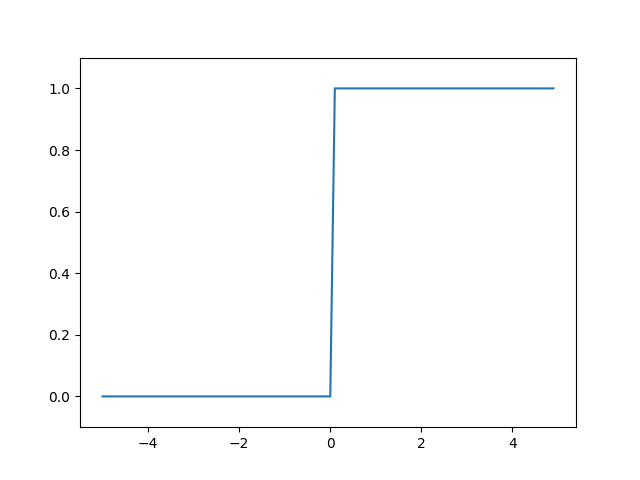

2. #### **시그모이드 함수 (sigmoid function)**

> **EXPRSSION**
>
> $$
> h(x) = {1\over{1 + e^{-x}}} \
> $$
>
> <br/>
>
> **CODE**
>
> ```python
> def sigmoid(x: float | np.ndarray):
> 	return 1 / (1 + np.exp(-x))
> ```
>
> <br/>
>
> **GRAPH**
>
> 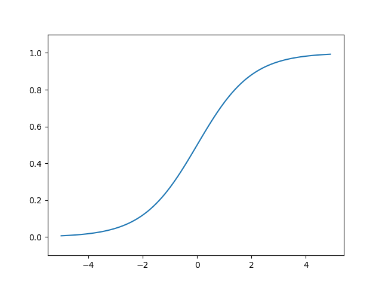

3. #### **ReLU 함수 (Rectified Linear Unit)**

> **EXPRESSION**
>
> $$
> h(x) =
> \begin{cases}
> \ \ x & ( x \ > \ 0 ) \\
> \\
> \ \ 0 & ( x \ \leq \ 0 ) \\
> \end{cases}
> $$
>
> **CODE**
>
> ```python
> def relu(x: float | np.ndarray):
> 	return np.maximum(0, x)
> ```
>
> <br/>
>
> **GRAPH**
>
> 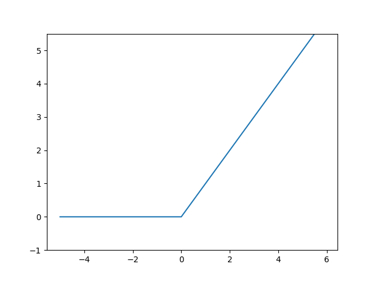

<br/>

<br/>

|   활성화 함수   |                      특징                      |                     장점                     |                                                                                        단점                                                                                        |
| :-------------: | :--------------------------------------------: | :------------------------------------------: | :--------------------------------------------------------------------------------------------------------------------------------------------------------------------------------: |
|    계단 함수    |   출력이 0 또는 1.<br />이진 분류에 적합함.    |           간단하고 이해하기 쉬움.            |     미분이 불가능하여 [**경사하강법(Gradient_descent)**](https://en.wikipedia.org/wiki/Gradient_descent)에 사용하기 어려움.<br />다중 클래스 분류나 회귀에는 사용하기 어려움.      |
| 시그모이드 함수 |   출력이 0과 1 사이.<br />확률로 해석 가능.    | 이진 분류 문제에 유용.<br />비선형성을 도입. | **[기울기 소실(vanishing gradient) 문제](https://en.wikipedia.org/wiki/Vanishing_gradient_problem)** .<br />계산 비용이 높음.<br />출력이 항상 양수로, 학습 속도가 느려질 수 있음. |
|    ReLU 함수    | 출력이 0 또는 양수.<br />음수에 대해 0을 출력. |   경사 소실 문제를 완화.<br />계산 효율적.   |                                     음수 입력에 대해 항상 0을 출력하는 **[죽은 ReLU(dying ReLU) 문제](https://brunch.co.kr/@kdh7575070/27)**.                                      |

이외에도 다양한 활성화 함수가 있으며 [링크](https://en.wikipedia.org/wiki/Activation_function)를 방문하여 확인할 수 있다.

<br/>

<br/>

## 다차원 배열

```python
A = np.array([1,2,3,4])
np.ndim(A)  #  1
A.shape 	# (4,)
# 1차원 배열의 경우에도 다차원 배열일때와 통일된 형태로 반환하기 위해 튜플을 반환한다.

B = np.array([[1,2], [3,4], [5,6]])
np.ndim(B)  #  2
B.shape 	# (3,2)
# 2차원 배열은 "행렬(matrix)"라고 불리며 가로방향을 "행(row)" 세로방향을 "열(column)"이라고 부른다.
```

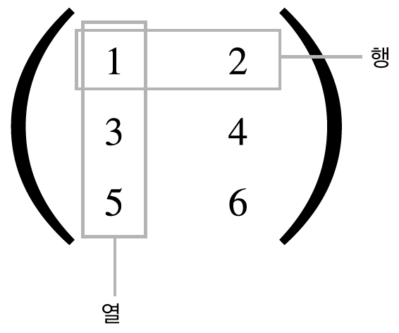

### 행렬의 곱

**CODE**

```python
A = np.array([[1,2],[3,4]])
B = np.array([[5,6],[7,8]])

np.dot(A,B)
# array([[19,22],
#		 [43,50]]])
```

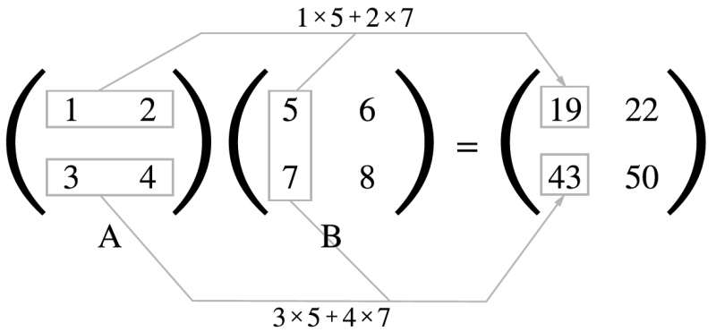

<br/>

다차원 배열을 곱하기 위해서는 두 행렬의 대응하는 차원의 원소수를 일치시켜야 한다.

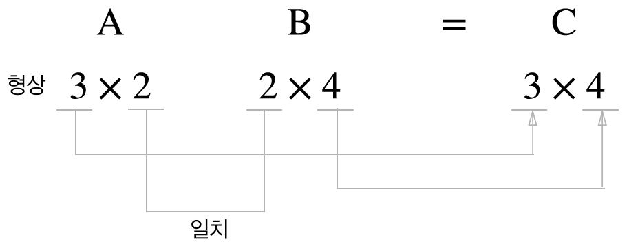


<br/>

#### 참고

> 넘파이에서 행렬의 곱셈을 수행할때 사용되는 함수로 [`np.dot`](https://numpy.org/devdocs/reference/generated/numpy.dot.html)과 [`np.matmul`](https://numpy.org/devdocs/reference/generated/numpy.matmul.html)이 있다.
>
> 두 배열이 **2차원** 또는 **1차원**인 경우 같은 결과를 내지만, **3차원**이상일 때, 서로 다른 결과가 발생한다.

```python
A = np.array([[1, 2], [3, 4]])
B = np.array([[[1, 1], [0, 1]], [[5, 0], [0, 0]]])

np.dot(A, B)
#[[[ 1  3]
#  [ 5  0]]
# [[ 3  7]
#  [15  0]]]

np.matmul(A, B)
#[[[ 1  3]
#  [ 3  7]]
# [[ 5  0]
#  [15  0]]]
```

#### np.dot

> $$
> \begin{pmatrix}
> 1 & 2 \\
> 3 & 4 \\
> \end{pmatrix}
> \cdot
> \begin{pmatrix}
> \begin{pmatrix}
> 1 & 1 \\
> 0 & 1 \\
> \end{pmatrix}\\
> \begin{pmatrix}
> 5 & 0 \\
> 0 & 0 \\
> \end{pmatrix}
> \end{pmatrix} =
> \begin{pmatrix}
> \begin{pmatrix}
> 1 * 1 + 2 * 0 & 1 * 1 + 2 * 1 \\
> 1 * 5 + 2 * 0 & 1 * 0 + 2 * 0 \\
> \end{pmatrix}\\
> \begin{pmatrix}
> 3 * 1 + 4 * 0 & 3 * 1 + 4 * 1 \\
> 3 * 5 + 4 * 0 & 3 * 0 + 4 * 0 \\
> \end{pmatrix}
> \end{pmatrix} =
> \begin{pmatrix}
> \begin{pmatrix}
> 1 & 3 \\
> 5 & 0 \\
> \end{pmatrix}\\
> \begin{pmatrix}
> 3 & 7 \\
> 15 & 0 \\
> \end{pmatrix}
> \end{pmatrix}
> $$

<br/>

#### np.matmul

> $$
> \begin{pmatrix}
> 1 & 2 \\
> 3 & 4 \\
> \end{pmatrix}
> \cdot
> \begin{pmatrix}
> \begin{pmatrix}
> 1 & 1 \\
> 0 & 1 \\
> \end{pmatrix}\\
> \begin{pmatrix}
> 5 & 0 \\
> 0 & 0 \\
> \end{pmatrix}
> \end{pmatrix}=
> \begin{pmatrix}
> \begin{pmatrix}
> 1 * 1 + 2 * 0 & 1 * 1 + 2 * 1 \\
> 3 * 1 + 4 * 0 & 3 * 1 + 4 * 1 \\
> \end{pmatrix}\\
> \begin{pmatrix}
> 1 * 5 + 2 * 0 & 1 * 0 + 2 * 0 \\
> 3 * 5 + 4 * 0 & 3 * 0 + 4 * 0 \\
> \end{pmatrix}
> \end{pmatrix}=
> \begin{pmatrix}
> \begin{pmatrix}
> 1 & 3 \\
> 3 & 7 \\
> \end{pmatrix}\\
> \begin{pmatrix}
> 5 & 0 \\
> 15 & 0 \\
> \end{pmatrix}
> \end{pmatrix}
> $$

<br/>

```python
a = np.ones([9, 5, 7, 4])
c = np.ones([9, 5, 4, 3])

np.dot(a, c).shape 		# (9, 5, 7, 9, 5, 3)
np.matmul(a, c).shape 	# (9, 5, 7, 3)
```

<br/>

<br/>

## 3층 신경망 구현

### 표기법

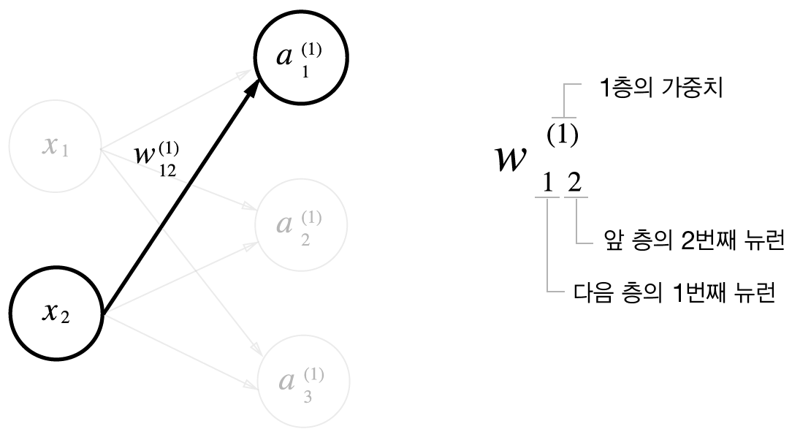

<br/>

#### 1층 구현

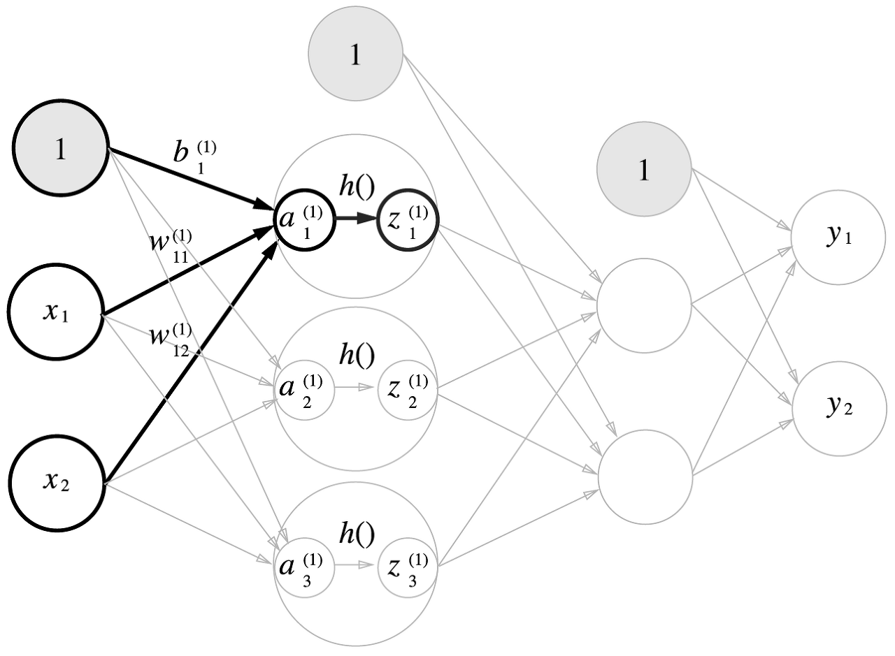

```python
X = np.array([1.0, 0.5]) 		# X : 입력값 (2,)
W1= np.array([[0.1, 0.3, 0.5],
              [0.2, 0.4, 0.6]])	# W1 : 1층의 가중치 (2, 3)
B1 = np.array([0.1, 0.2, 0.3]) 	# B1 : 1층의 편향 (3,)

A1 = np.dot(X,W1) + B1			# A1 : 1층의 가중치 합 (3,)
Z1 = sigmoid(A1)				# Z1 : 1층의 출력 (3,)
```

<br/>

#### 2층 구현


```python
W2 = np.array([[0.1, 0.4],
               [0.2, 0.5],
               [0.3, 0.6]])	# W2 : 2층의 가중치 (3, 2)
B2 = np.array([0.1, 0.2])	# B2 : 2층의 편향 (2,)

A2 = np.dot(Z1, W2) + B2	# A2 : 2층의 가중치 합 (2,)
Z2 = sigmoid(A2)			# Z2 : 2층의 출력 (2,)
```

<br/>

#### 출력층 구현

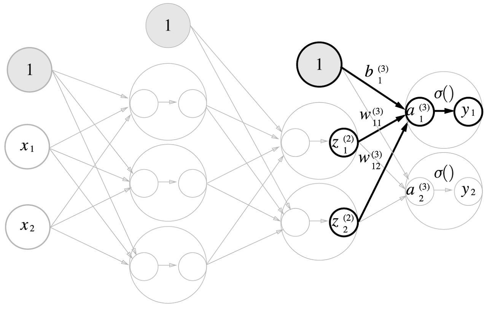

```python
def identity_function(x):
    return x

W3 = np.array([[0.1, 0.3],
               [0.2,0.4]])	# W3 : 3층의 가중치 (2, 2)
B3 = np.array([0.1, 0.2])	# B3 : 3층의 편향 (2,)

A3 = np.dot(Z2, W3) + B3	# A3 : 3층의 출력 (2,)
Y = identity_function(A3) 	# Y = A3
```

> 위의 예시에서는 출력층의 활성화 함수로 항등 함수를 사용하였다.
>
> 출력층의 활성화 함수는 문제의 성질에 맞게 정한다.
>
> 일반적으로 회귀에는 **항등함수**, 이진 분류에는 **시그모이드 함수**, 다중 분류에는 **소프트맥스 함수**를 사용한다.

<br/>

#### 정리

```python
def sigmoid(x):
    return 1/(1+np.exp(-x))

def identity_function(x):
    return x

def init_network():
    network = {}
    network['W1'] = np.array([[0.1, 0.3, 0.5],[0.2, 0.4, 0.6]])
    network['b1'] = np.array([0.1, 0.2, 0.3])
    network['W2'] = np.array([[0.1, 0.4],[0.2, 0.5],[0.3, 0.6]])
    network['b2'] = np.array([0.1, 0.2])
    network['W3'] = np.array([[0.1, 0.3],[0.2,0.4]])
    network['b3'] = np.array([0.1, 0.2])
    return network

def forward(network, x):
    W1, W2, W3 = network['W1'], network['W2'], network['W3']
    b1, b2, b3 = network['b1'], network['b2'], network['b3']
    a1 = np.dot(x, W1)+b1
    z1 = sigmoid(a1)
    a2 = np.dot(z1, W2)+b2
    z2 = sigmoid(a2)
    a3 = np.dot(z2, W3)+b3
    y = identity_function(a3)
    return y

network = init_network()
x = np.array([1.0, 0.5])
y = forward(network, x)
```

<br/>

### 소프트맥스 함수

> **EXPRSSION**
>
> $$
> \Huge
> y_k = \frac{e^{a_k}}{\Sigma_{i=1}^{n} e^{a_i}} \\
> $$
>
> <br/>
>
> **CODE**
>
> ```python
> def softmax(a):
>  exp_a = np.exp(a)
>  sum_a = np.sum(exp_a)
>  y = exp_a / sum_a
>
>  return y
> ```
>
> > 소프트맥스 함수는 지수함수를 사용하기 때문에 위 구현에서 지수가 커지면 오버플로우 문제가 발생한다.
>
> <br/>
>
> **SOLUTION**
>
> $$
> \Huge
> \begin{align}
> y_k = \frac{e^{a_k}}{\Sigma_{i=1}^{n} e^{a_i}} = \frac{Ce^{a_k}}{C\Sigma_{i=1}^{n} e^{a_i}} \\
> \\
> = \frac{e^{a_k + logC}}{\Sigma_{i=1}^{n} e^{a_i + logC}} \\
> \\
> = \frac{e^{a_k + C'}}{\Sigma_{i=1}^{n} e^{a_i + C'}} \\
> \end{align}
> $$
>
> > 위의 식은 지수 법칙을 활용하여 식을 변형한 결과이다.
> >
> > 지수에 임의의 수 $C'$을 더하거나 빼도 결과가 바뀌지 않는다는 것을 알 수 있다.
>
> <br/>
>
> **MODIFIED CODE**
>
> ```python
> def softmax(a):
>     c = np.max(a)	# 지수의 최댓값을 선택한다.
>     exp_a = np.exp(a - c)
>     sum_a = np.sum(exp_a)
>     y = exp_a / sum_a
>
>     return y
> ```
>
> <br/>
>
> **특징**
>
> 1. **확률**
>
>    소프트맥스 함수의 출력 값을 모두 합하면 1이 된다.
>
>    이는 각 출력을 특정 클래스에 속할 확률로 해설할 수 있다.
>
> 2. **단조 증가**
>
>    소프트맥스 함수는 밑이 $e$인 지수함수를 사용하였으며, 지수함수의 특성으로 인해 대소관계가 변하지 않는다.
>
>    즉, 소프트맥스 함수는 입력 값의 차이를 확대할 뿐, 대소관계는 유지한다.

## 손글씨 숫자 인식

손글씨 숫자 분류 태스크를 통해 추론 과정을 구현한다.

이 추론 과정을 신경망의 **순전파(forward propagation)**라고도 한다.

<br/>

### MNIST 데이터셋

MINST 데이터 셋은 0부터 9까지의 숫자 이미지로 구성되어 있으며, 훈련 이미지 60,000장과 시험 이미지 10,000장으로 구성된다.

```python
import sys, os
sys.path.append(os.pardir)  # 부모 디렉터리의 파일을 가져올 수 있도록 설정
from dataset.mnist import load_mnist

(x_train, t_train), (x_test, t_test) = load_mnist(flatten=True, normalize=False)
```

<br/>

#### load_mnist

> MINST 데이터를 **(훈련 이미지, 훈련 레이블), (시험 이미지, 시험 레이블)** 형식으로 반환한다.
>
> 1. normalize : 입력 이미지의 픽셀 값을 0.0 ~ 1.0사이의 값으로 정규화할지를 정한다. False인 경우, 0 ~ 255 사이의 값을 유지한다.
> 2. flatten : 입력 이미지를 1차원 배열로 만들지를 정한다. False로 설정하면 입력 이미지를 1 X 28 X 28의 3차원 배열로, True로 설정하면 748개의 원소로 이뤄진 1차원 배열로 저장한다.
> 3. one_hot_label : 레이블을 **원-핫 인코딩**형태로 저장할지를 정한다. 원-핫 인코딩이란, 에를 들어 [0,0,1,0,0,0,0,1,0,0.0]처럼 정답을 뜻하는 원소만 1이고, 나머지는 모두 0인 배열이다. False일 경우, '7'이나 '2'와 같이 숫자 형태의 레이블을 저장한다.

```python
from PIL import Image

def img_show(img):
    pil_img = Image.fromarray(np.unit8(img))
    pil_img.show()

img = x_train[0]
print(img.shape) # (784,0)

img_show(img)
```


```python
img = img.reshape(28, 28)
print(img.shape) # (28, 28)

img_show(img)
```


<br/>

### 신경망의 추론 처리

이미지의 크기가 28 X 28 = 784이고, 0 ~ 9까지 총 10개의 숫자를 구분하는 문제이다.

따라서 입력층의 뉴런은 784개, 출력층의 뉴런은 10개로 구성한다.

은닉층은 임의로 1층을 50개, 2층을 100개로 하여 총 두 개의 은닉층을 구성한다.

#### CODE

```python
def get_data():
    (x_train, t_train), (x_test, t_test) = load_mnist(flatten=True, normalize=False, one_hot_label=False)
    return x_test, t_test

def init_network():
    with open("sample_weight.pkl",'rb') as f:  # pickle 파일인 sample_weight.pkl에 저장된 '학습된 가중치 매개변수'를 읽는다.
        network = pickle.load(f)

    return network

def predict(network, x):
    W1,W2,W3 = network['W1'],network['W2'],network['W3']
    b1,b2,b3 = network['b1'],network['b2'],network['b3']

    a1 = np.dot(x,W1) + b1
    z1 = sigmoid(a1)
    a2 = np.dot(z1,W2) + b2
    z2 = sigmoid(a2)
    a3 = np.dot(z2,W3) + b3
    y = softmax(a3)

    return y


x, t = get_data() # x : 시험 이미지, t : 시험 레이블
network = init_network()

accuracy_cnt = 0
for i in range(len(x)):
    y = predict(network,x[i]) #추론을 수행
    p = np.argmax(y) #확률이 가장 높은 원소의 인덱스를 얻음

    if p == t[i]:
        accuracy_cnt += 1

print('Accuracy:' + str(float(accuracy_cnt)/len(x)))
```

<br/>

#### 배치 처리

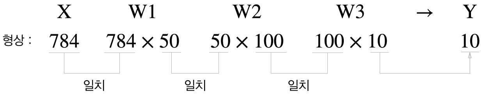

기존의 코드를 실행하면 784개로 구성된 1차원 배열이 입력되어 원소가 10개인 1차원 배열이 출력된다.

이미지 여러장을 한꺼번에 입력하는 경우를 생각해보자.


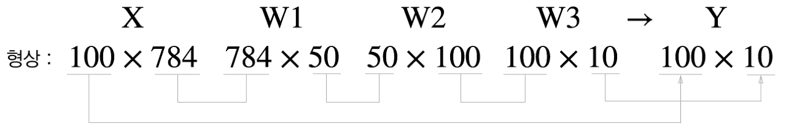

위 코드의 입력 데이터 형상은 100 X 784, 출력은 100 X 10이다.

100장의 입력 데이터 결과가 한 번에 출력됨을 나타낸다.

이처럼, 하나로 묶은 입력 데이터를 **배치(batch)**라고 한다.

<br/>

> 배치 처리는 이미지 1장당 처리 시간을 대폭 줄여준다.
>
> 수치 계산 라이브러리는 큰 배열을 효율적으로 처리하며,  I/O 횟수를 줄여 순수 계산을 수행하는 시간을 줄일 수 있다.

<br/>

#### 배치 처리 적용 CODE

```python
x, t = get_data()
network = init_network()

batch_size = 100 # 배치 크기
accuracy_cnt = 0

for i in range(0, len(x), batch_size):
    batch_in = x[i:i+batch_size]
    y = predict(network, batch_in)
    p = np.argmax(y, axis=1)
    accuracy_cnt += np.sum(p==t[i:i+batch_size])

print("Accuracy:" + str(float(accuracy_cnt) / len(x)))
```

<br/>

<br/>

## 참고자료
