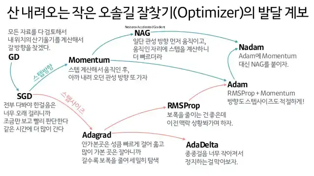

# 6장 학습 관련 기술들

## 옵티마이저
손실 함수를 줄여나가면서 학습해가는 방식



[참고](https://www.slideshare.net/yongho/ss-79607172)

#### SGD


비등방성 함수(방향에 따라 성질, 즉 여기에서는 기울기가 달라지는 함수)에서는 탐색 경로가 비효율적임.


학습률이 낮을 경우 지역 최솟값(Local minimum) 문제에 갖히는 경우도 발생한다.
```python
class SGD:
    """확률적 경사 하강법（Stochastic Gradient Descent）"""

    def __init__(self, lr=0.01):
        self.lr = lr
        
    def update(self, params, grads):
        for key in params.keys():
            params[key] -= self.lr * grads[key] 
```
#### 모멘텀 
SGD가 너무 지그재그로 움직이는것을 해결하기 위해 관성과 속도를 넣어주어 비교적 한 방향으로 더 이동할수 있도록 함.

```python
class Momentum:
    """모멘텀 SGD"""

    def __init__(self, lr=0.01, momentum=0.9):
        self.lr = lr
        self.momentum = momentum
        self.v = None
        
    def update(self, params, grads):
        if self.v is None:
            self.v = {}
            for key, val in params.items():                                
                self.v[key] = np.zeros_like(val)
                
        for key in params.keys():
            self.v[key] = self.momentum*self.v[key] - self.lr*grads[key] # v 값은 속도를 의미하며 관성을 넣어줌
            params[key] += self.v[key]
```

#### AdaGrad
학습률을 감소시켜 처음에는 크게 학습하다가 조금씩 적게 학습하는 방법.

```python
class AdaGrad:
    """AdaGrad"""

    def __init__(self, lr=0.01):
        self.lr = lr
        self.h = None
        
    def update(self, params, grads):
        if self.h is None:
            self.h = {}
            for key, val in params.items():
                self.h[key] = np.zeros_like(val)
            
        for key in params.keys():
            self.h[key] += grads[key] * grads[key] # 기존 기울기 값을 제곱하여 더해주어 h에 반영 
            params[key] -= self.lr * grads[key] / (np.sqrt(self.h[key]) + 1e-7) # 매개변수 반영시 1/sqrt(h) 를 곱해 학습률 조정
```

### RMSProp
AdaGrad는 학습 횟수가 계속 늘어나면 학습률이 계속 작아져 어느 순간부터 갱신량이 0이 됨.

이를 해결하기 위해 먼 과거의 기울기는 잊고 새로운 기울기 정보를 크게 반영하는 방법.

#### Adam
RMSProp과 Momentum을 융합한 방법.
```python
class Adam:
    """Adam (http://arxiv.org/abs/1412.6980v8)"""

    def __init__(self, lr=0.001, beta1=0.9, beta2=0.999):
        self.lr = lr
        self.beta1 = beta1
        self.beta2 = beta2
        self.iter = 0
        self.m = None # RMSProp의 새로운 기울기 정보를 크게 반영
        self.v = None # Momentum의 관성
        
    def update(self, params, grads):
        if self.m is None:
            self.m, self.v = {}, {}
            for key, val in params.items():
                self.m[key] = np.zeros_like(val)
                self.v[key] = np.zeros_like(val)
        
        self.iter += 1
        lr_t  = self.lr * np.sqrt(1.0 - self.beta2**self.iter) / (1.0 - self.beta1**self.iter)         
        
        for key in params.keys():
            #self.m[key] = self.beta1*self.m[key] + (1-self.beta1)*grads[key]
            #self.v[key] = self.beta2*self.v[key] + (1-self.beta2)*(grads[key]**2)
            self.m[key] += (1 - self.beta1) * (grads[key] - self.m[key])
            self.v[key] += (1 - self.beta2) * (grads[key]**2 - self.v[key])
            
            params[key] -= lr_t * self.m[key] / (np.sqrt(self.v[key]) + 1e-7)
            
            #unbias_m += (1 - self.beta1) * (grads[key] - self.m[key]) # correct bias
            #unbisa_b += (1 - self.beta2) * (grads[key]*grads[key] - self.v[key]) # correct bias
            #params[key] += self.lr * unbias_m / (np.sqrt(unbisa_b) + 1e-7)
```

## 가중치의 초기값

### 가중치의 초기값을 0으로 초기화 하지 않는 이유
가중치를 0으로 초기화하지 않는 이유는 가중치가 0이 아니어야 분류 결과에 영향을 주기 때문입니다.

가중치가 0으로 초기화 되어 있다면 학습률(learning rate: r)은 가중치 벡터의 방향이 아니라 크기에만 영향을 미칩니다.

가중치 w가 업데이트 되는 공식은 다음과 같이 정의할 수 있습니다.

```
$$ \\Delta w\_i = r(y - y')x $$
```

퍼셉트론 학습 규칙에서 초기 가중치를 0으로 놓으면 다음과 같이 정리가 됩니다.

```
$$ w\_1 = w\_0 + \\Delta w\_1 $$

$$ = w\_0 + r(y\_1 - y\_1')x\_1 $$

$$ = w\_0 + r(y\_1 - \\Phi(w\_0x\_1))x\_1 $$

$$ = r(y\_1 - \\Phi(0))x\_1 $$

$$ = r(y\_1 - 1)x\_1 $$
```

그러면 학습률 r은 가중치 벡터의 크기에만 영향을 미치게 됩니다.

w0 값이 0이 아니라면 학습률에 따라 w1 방향이 바뀝니다.

### 가중치 초깃값 테스트
[1권_6장_가중치 초깃값.ipynb](1%EA%B6%8C_6%EC%9E%A5_%EA%B0%80%EC%A4%91%EC%B9%98%20%EC%B4%88%EA%B9%83%EA%B0%92.ipynb)

## 배치 정규화
각 층의 활성화를 적당히 퍼뜨리도록 강제화하기 좋음 

-> Local optimum 문제에 빠질 가능성을 줄여줌.


### 왜 배치 정규화를 사용하지 않으면 학습이 불안정한가요?
> `Internal Covariate Shift` is the change in the distribution of network activations 
> due to the change in network parameters during training.

레이어를 통과할때마다 출력값이 데이터 분포에 큰 영향을 주어 다음 매개변수 값들의 변동이 커지게 되고 값이 팽창하게 됨. 

### 수식
아래 알고리즘이 신경망에 삽임 됨.
```
$$ \mu = \frac{1}{m} \sum_{i=1}^{m} \textbf{x}^{(i)} $$ # 평균

$$ \sigma^2 = \frac{1}{m} \sum_{i=1}^{m} (\textbf{x}^{(i)} – \mu)^2 $$ # 분산

$$ \textbf{x}^{(i)}_{new} = \frac{\textbf{x}^{(i)} – \mu}{\sqrt{\sigma^2 + \epsilon}} $$ # 정규화

$$ \textbf{z}^{(i)} = \gamma \textbf{x}^{(i)}_{new} + \beta $$ # scalse and shift
```

### 배치 정규화의 장점
- 학습을 빨리 진행할 수 있다.(학습 속도 개선) -> 히든 레이어에서 정규화를 하면서 입력분포가 일정하게 되고 이에 따라 learning rate를 크게 해도 괜찮아짐
- 초깃값에 크게 의존하지 않는다. (골치 아픈 초깃값 선택 장애 X) -> 학습할 때마다 활성화/출력값을 정규화하기 때문.
- 오버피팅을 억제한다. (드롭아웃 등의 필요성 감소)

## 오버피팅
신경망이 훈련 데이터에만 지나치게 적응되어 그 외의 데이터에는 제대로 대응하지 못하는 상태.

#### 주로 다음과 같은 경우에 발생
- 매개변수가 많고 표현력이 높은 모델
- 훈련 데이터가 적음


### 가중치 감소
오버피팅은 가중치 매개변수의 값이 커서 발생하는 경우가 많기 때문에 큰 가중치에 대해 패널티를 부과하여 오버피팅을 억제한다.

예를 들어 손실 함수에 L2 정규화 값을 더해주어 가중치가 커지는것을 억제한다.

#### L1, L2 정규화
- L2 정규화: w^2 에 대한 패널티 
- L1 정규화 |w| 에 대한 패널티 

### 드롭아웃
신경망 모델이 복잡해지면 가중치 감소만으로는 대응하기 어려워짐.
이때 뉴런의 연결을 임의로 삭제하면서 학습하여 오버피팅을 억제할수 있다.

```python
class Dropout:
    def __init__(self, dropout_ratio=0.5):
        self.dropout_ratio = dropout_ratio
        self.mask = None

    def forward(self, x, train_flg=True):
        if train_flg:
            self.mask = np.random.rand(*x.shape) > self.dropout_ratio
            return x * self.mask
        else:
            return x * (1.0 - self.dropout_ratio)

    def backward(self, dout):
        return dout * self.mask
```

### 앙상블
같은 or 다른 학습 세트를 개별적으로 학습시킨 여러 모델의 출력을 평균내어 추론하는 방식.
각 초기값이 달라 결과값도 달라지며 드롭아웃과 비슷한 효과를 낼수 있다.
학습 시킬 장비가 많을때 좋음.
드롭아웃은 앙상블 학습효과를 하나의 네트워크에서 구현했다고 볼수 있음.

## 하이퍼파라미터
데이터셋을 모델 훈련에 사용할 `훈련 세트`와 일반화 성능을 추정하는데 사용할 `테스트 세트`로 나눈다.

그리고 예측 성능을 높이기 위해 하이퍼파라미터를 튜닝하고 비교해야 하는데,

이때 모델 선택에 같은 테스트 세트를 반복해서 재사용하면 이는 훈련 세트의 일부가 되는 셈이고 모델이 과적합되는데 원인이 된다.

그러므로 데이터 셋을 훈련 세트, 검증 세트, 테스트 세트로 나누는 것이 적합함.


- 홀드아웃 교차 검증(holdout cross-validation)

검증 세트를 이용하여 다른 하이퍼파라미터 값에서 모델을 훈련하는 것을 계속 반복하고 성능을 평가한 뒤, 

만족할만한 성능이 나온 하이퍼파라미터를 이용하여 테스트 세트에서 모델의 일반화 성능을 추정.


- k-겹 교차 검증(k-fold cross-validation)


k-겹 교차 검증은 홀드아웃에 비해 훈련 세트의 분할에 덜 민감한 성능 추정을 얻을 수 있음.

중복을 허락하지 않고 훈련 데이터셋을 k개의 폴드로 랜덤하게 나눈 뒤, k-1개의 폴드로 모델을 훈련하고 나머지 하나의 폴드로 성능을 평가.

이 과정을 k번 반복하여 k개의 모델과 성능 추정을 얻는다.

만족할만한 성능이 나온 하이퍼파라미터를 찾은 후에는 전체 훈련 세트를 사용하여 모델을 다시 훈련하고 독립적인 테스트 세트를 이용하여 최종 성능 추정을 한다.

> 훈련 세트가 작다면 폴드 갯수를 늘리는것이 좋다.
> 
> k 값이 증가하면 훈련 데이터가 더 여러번 반복해서 사용되고, 모델 성능을 평균하여 일반화 성능을 추정할 때 더 낮은 편향을 만든다.

- 계층적 k-겹 교차 검증(stratified k-fold cross-validation)

데이터가 한쪽으로 편향되어 있을 경우 k-겹 교차검증을 사용했을때 성능 평가가 잘 되지 않을 수 있다.

그럴때 계층적 k-겹 교차 검증을 사용한다.

계층적 k-겹 교차 검증은 각 폴드에서 클래스 비율이 전체 훈련 세트에 있는 클래스 비율을 대표하도록 유지한다.


##### 일반적으로 회귀에는 k-겹 교차검증을 사용하고 분류에는 StratifiedKFold를 사용한다.

