## TL;DR

- 챕터 주제 : 딥러닝의 특징과 과제, 그리고 가능성
- 신경망을 더 깊게 해서 성능을 개선할 수 있다.
- GPU와 분산 학습, 비트 정밀도 감소 등으로 딥러닝을 고속화할 수 있다.
- 딥러닝의 응용 분야로는 사진 캡션 생성, 이미지 생성, 강화학습 등이 있다.

 

## 8.1 더 깊게 / 8.2 딥러닝의 초기 역사

### 1) MNIST **손글씨 숫자 인식**

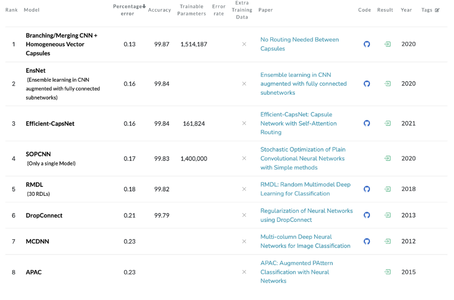

순위를 보면 거의 CNN 기반의 모델이 상위권이다. CNN을 기반으로 해서 앙상블 학습, 학습률 감소, 데이터 확장 등을 이용해 정확도를 높였다.

 

- 앙상블 학습 : 여러 개의 개별 모델을 조합하여 최적의 모델로 일반화하는 방법이다. 랜덤 포레스트가 그 대표적이 예다.
- 데이터 확장 (Data Augmentation) : 입력 이미지를 인위적으로 확장해 개수를 늘려 쉽고 효과적으로 정확도 개선이 가능한 방법이다. 회전(rotate), 이동(translation), 자르기(crop), 뒤집기(flip), 크기 수정(rescale), 밝기 변화(lighting condition) 등의 방법이 있다.

 

 

### 2) ILSVRC 이미지 인식 대회

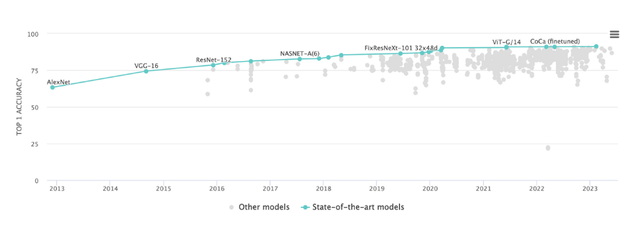

이미지 링크 : https://paperswithcode.com/sota/image-classification-on-imagenet

 

ILSVRC(ImageNet Large-Scale Visual Recognition Challenge)는 컴퓨터 비전 분야의 ‘올림픽’이라 할 수 있는 이미지 인식 기술 대회다. 대회에서는 100만 장이 넘는 이미지를 담고 있는 ‘이미지넷’ 데이터셋을 사용하고 분류 부문에서는 1000개의 클래스를 제대로 분류하는지를 겨룬다.

2012년 AlexNet이 2위(15.4%)와 큰 폭으로 1위(26.2%)를 하면서 딥러닝이 지금처럼 큰 주목을 받게 됐다. 그 이후 딥러닝을 활용한 기법이 꾸준히 정확도를 개선해왔다. 특히 2015년에는 150층이 넘는 ResNet이 오류율을 3.5% 까지 낮췄다. 인간의 분류 오차가 5~10% 정도라는 걸 감안하면 놀라운 성적이다.

 * ViT가 나온 2021년 이후 상위권 모델은 거의 Transformer 또는 Conv+Transformer 기반 모델이다.

  

### LeNet (1998)

20년 전 제안된 첫 CNN, 손글씨 숫자를 인식하는 네트워크다. 합성곱 계층과 풀링 계층을 반복하고 마지막으로 완전연결 계층을 거치면서 결과를 출력한다.

 

### AlexNet (2012)

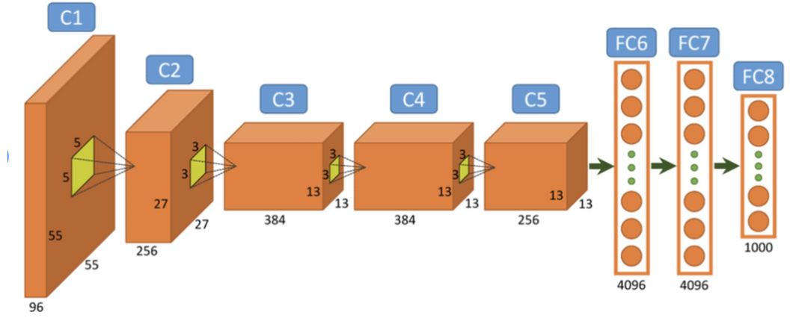

ILSVRC 대회에서 의미있는 성능을 낸 첫번째 CNN 아키텍처. 기본적으로 LeNet과 비슷하지만 활성화 함수로 ReLU를 사용, LRN이라는 국소적 정규화를 실시, 드랍아웃을 사용한다는 차이가 있다.

 

### VGG (2014)

3x3 작은 필터를 사용한 합성곱 계층을 2~4개씩 쌓아 연속으로 거친다. 그리고 풀링 계층으로 크기를 절반으로 줄이다가 마지막에 완전연결 계층을 통과시켜 결과를 출력한다.

 

> 👆필터 크기를 3x3으로 고정한 이유?
>  커널 사이즈가 크면 이미지 사이즈 축소가 급격하게 이루어져 깊은 층 만들기가 어렵고, 파라미터 개수와 연산량이 많이 필요하기 때문이다.

 

### GoogLeNet (2014)

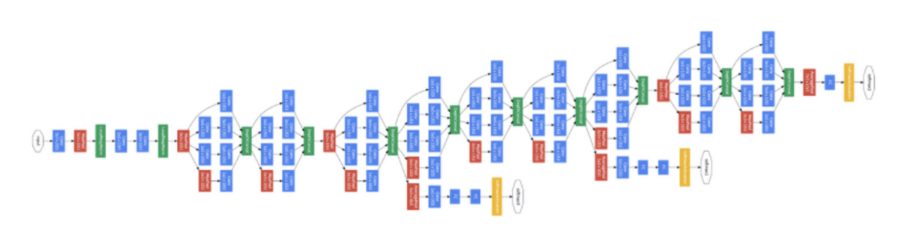

GooLeNet은 세로 방향 깊이뿐 아니라 가로 방향도 깊다. 하나의 layer에서 다양한 종류의 filter나 pooling을 도입해 개별 layer를 두텁게 확장시킬 수 있다는 Inception module 이라는 창조적인 아이디어를 제시했다. 

또 다른 특징으로 1x1 크기의 필터를 사용하는 것이다. 1x1 합성곱 연산은 채널의 크기를 줄여 매개변수 제거와 고속 처리에 기여한다.

 

### ResNet (2015)

마이크로소프트 팀이 개발한 네트워크로 보다 층을 깊게 할 수 있는 특별한 ‘장치’를 포함하는 네트워크다. AlexNet이 5개층, GoogleNet이 22개층으로 CNN 아키텍처의 층이 점점 깊어졌지만 Gradient Vanishing 문제로 한계가 있었다. ResNet은 그래디언트가 잘 흐를 수 있도록 일종의 지름길(shortcut, skip connection)을 만들어 주자는 아이디어다.

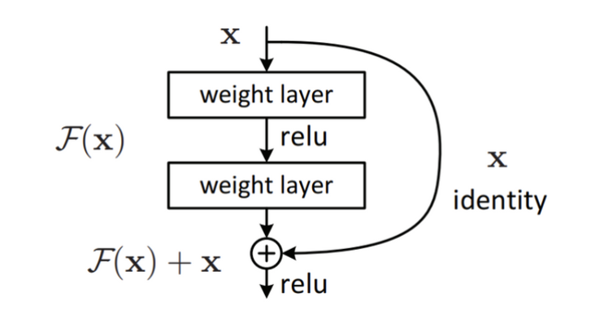

스킵 연결(skip connection)은 입력 데이터를 합성곱 계층을 건너뛰어 출력에 바로 더하는 구조로 역전파 때도 상류의 기울기를 그대로 하류로 보내게 된다. 따라서 스킵 연결로 기울기가 작아지거나 지나치게 커질 걱정 없이 앞 층의 ‘의미 있는 기울기’가 전해지리라 기대할 수 있다.

 

### 층을 깊게 할 때의 이점

#### 1. 층을 깊게 한 신경망은 적은 매개변수로 같은(혹은 그 이상) 수준의 표현력을 달성할 수 있다.

CNN의 필터를 예로 들면 3x3 필터를 2회 수행하면 5x5 필터의 효과를 낼 수 있다. 3x3 필터의 매개변수는 18개(2x3x3)이지만 5x5 필터의 매개변수는 25개(5x5)다.

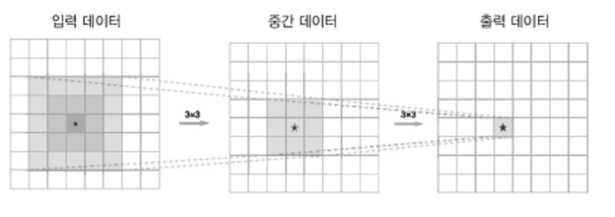

 

#### 2. 학습의 효율성. 학습 데이터의 양을 줄여 학습을 고속으로 수행할 수 있다.

신경망을 깊게 하면 학습해야 할 문제를 계층적으로 분해할 수 있다. 각 층이 학습해야 할 문제를 더 단순한 문제로 대체할 수 있다. 얕은 신경망에서는 하나의 합성곱 계층이 더 많은 특징을 이해해야 하므로 더 많은 양의 질 좋은 데이터를 필요로 하게 된다.

  

## 8.3 딥러닝 고속화

### 1) 계산 능력

> GPU 사용, 분산 학습

AlexNet의 forward에서 각 층이 소비하는 시간을 보면 90% 이상을 합성곱 계층에서 소요한다. 즉, 합성곱 계층에서 이뤄지는 ‘단일 곱셈-누산’을 어떻게 고속으로 효율적으로 하느냐가 중요하다.

대량 병렬 연산은 GPU(Graphics Processing Unit)의 특기이므로 딥러닝 프레임워크 대부분은 **GPU를 사용**하고, 더 고속화 하고자 다수의 GPU를 사용해 계산을 **‘분산 처리’** 한다. 분산 학습을 지원하는 딥러닝 프레임워크에는 대표적으로 구글 텐서플로우와 메타의 파이토치가 있다.

 

#### GPU

GPU는 주로 AMD와 NVIDIA 두 회사에서 제공한다. 하지만 CUDA라는 GPU 컴퓨팅용 통합 개발 환경으로 인해 인공지능 분야에서는 NVIDIA가 90% 이상의 점유율을 확보하고 있다. 최근 AMD와 허깅페이스의 파트너쉽으로 개발 환경을 제공하고자 한다고 하니 앞으로 지켜볼 필요가 있다.

 

#### 분산 학습

분산 학습에는 크게 Data Parallelism과 Model Parallelism이 있다. 

- Data Parallelism : 데이터를 여러 개의 GPU에 나눠 학습
- Model Parallelism : 모델 사이즈가 커서 하나의 GPU 메모리에 다 들어가지 않는 경우 여러 GPU에 모델의 파라미터를 나누어 연산

 

### 2) 메모리 용량과 버스 대역폭

> 양자화(Quantization), 가지치기(Pruning), 지식 증류(Distillation) 등

대량의 가중치 매개변수와 중간 데이터를 메모리에 저장해야 하고, GPU 버스를 흐르는 데이터가 많아져 병목이 될 수 있다. 이를 해결하기 위해서는 데이터의 비트 수를 최소로 만드는 것이 바람직하다.

컴퓨터에서는 주로 64비트나 32비트 부동소수점 수를 사용해 실수를 표현한다. 많은 비트를 사용할 수록 계산 오차는 줄어들지만 그만큼 계산에 드는 비용과 메모리 사용량이 늘고 버스 대역폭에 부담을 준다. 딥러닝은 높은 수치 정밀도(수치를 몇 비트로 표현하느냐)를 요구하지 않기 때문에 16비트 반정밀도만 사용해도 학습에 문제가 없다고 알려져 있다.

최근에는 실수형 변수를 정수형 변수로 변환하는 Quantization을 적극 사용하고 있으며 LLaMA의 경우 맥북에서도 실행되도록 4-bit 양자화도 진행됐다.

   

## 8.4 딥러닝의 활용 / 8.5 딥러닝의 미래

#### Object Detection & Segmetation

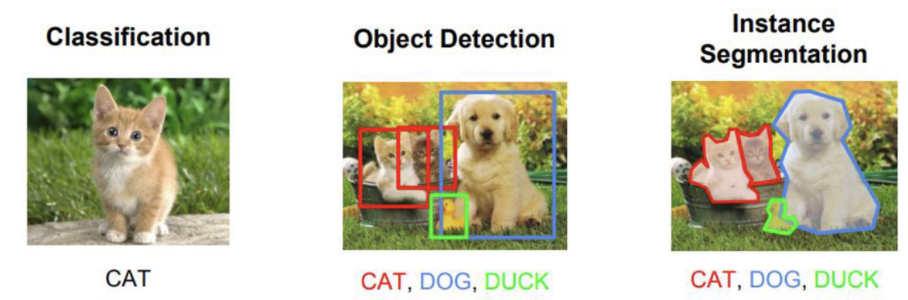

- 사물 검출 Object Detection : 이미지 속에 담긴 사물의 위치와 종류를 알아내는 기술. 
  그 중 R-CNN, YOLO, SSD 등의 모델이 유명하다.

- 분할 Segmetation : 이미지의 유사한 영역 또는 부분(segment)를 그룹화 하는 것. 
  FCN, U-Net, DeepLab 등의 모델이 있다.

 

#### Image Captioning

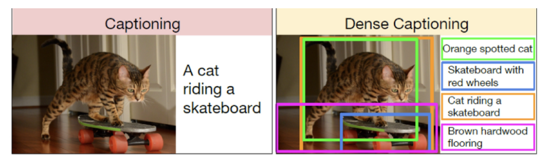

- 사진 캡션 생성 Image Captioning : 컴퓨터 비전과 자연어 처리를 융합한 연구로, 사진을 주면 사진을 설명하는 글을 자동으로 생성한다. 
  NIC(CNN + RNN), ClipCap 등의 모델이 있다.

 

#### Super Resolution

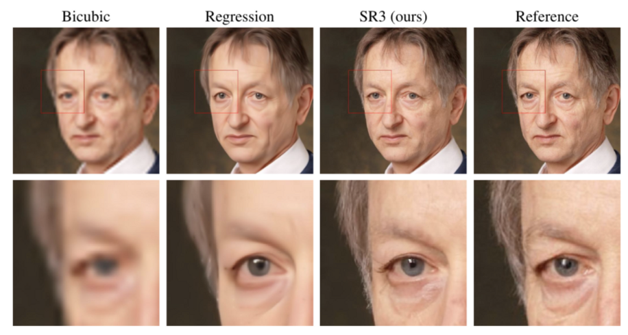

- 고해상도 변환 Super Resolution : 저해상도의 사진을 고해상도로 변환한다. 
  SRCNN, SRGAN 등의 모델이 있다.

 

#### Image Reconstruction

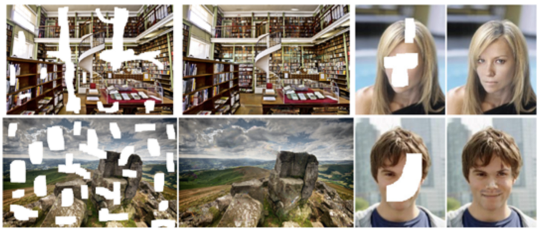

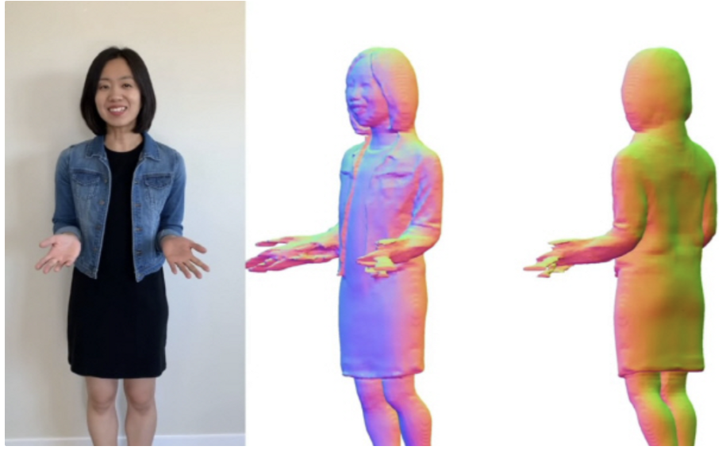

- 이미지 복원 Image Reconstruction : 손상된 이미지를 원래의 이미지로 복원하는 문제. 단순 복원을 넘어서 이미지로 3D 복원을 하는 분야로 확대되고 있다.

 

#### Image Synthesis

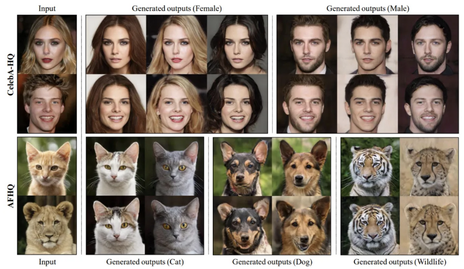

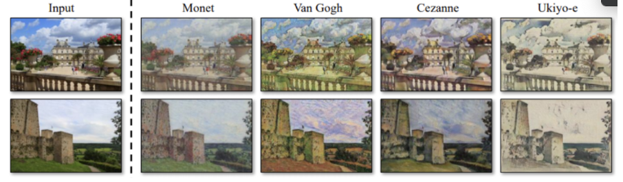

- 이미지 합성 Image Synthesis : 입력 이미지를 수정하거나 아무런 이미지 입력 없이 새로운 이미지를 생성한다.
- Text to Image : 문장이 주어졌을 때 문장에 부합하는 이미지를 생성하는 문제
- 이미지 스타일(화풍) 변환 : 특정 화가처럼 그림 그리는 연구

 

> 👆이미지 생성 분야의 대표 모델 GAN
>
> GAN은 **생성자(generator)**와 **식별자(discriminator)**로 불리는 2개의 신경망을 이용한다.**생성자** 는 진짜와 똑같은 이미지를 생성하고 **식별자** 는 그것이 진짜인지(생성 이미지인지, 촬영된 이미지인지)를 판정한다. 생성자와 식별자가 겨루도록 학습시켜 최종적으로 생성자는 진짜와 착각할 정도의 이미지를 그려낸다.
>
> 최근에는 Diffusion 계열의 모델을 사용한다.

 

#### 자율 주행

자율 주행에는 주행 경로를 정하는 경로 계획, 카메라나 렝저 등의 탐사 기술, 주위 환경을 올바르게 인식하는 기술 등의 다양한 기술을 필요로 한다. 그 중 안전한 주행 영역을 인식하는데 딥러닝이 큰 역할을 해줄 것으로 기대하고 있다.

예를 들어 SegNet이라는 CNN 기반 신경망은 입력 이미지를 분할(픽셀 수준에서 판정)해 주변 환경을 인식해낸다.

 

#### 강화 학습

강화학습 Reinforcement Learning은 사람이 시행착오를 겪으며 배우듯 컴퓨터도 시행착오 과정에서 스스로 학습하게 하려는 분야다. 강화학습에서는 에이전트가 환경에 맞게 행동을 선택하고 그 행동에 의해서 환경이 변한다는 게 기본적인 틀이다. 환경이 변화하면 에이전트는 어떠한 보상을 얻는데 강화학습의 목적은 더 나은 보상을 받는 쪽으로 에이전트의 행동 지침을 바로잡는 것이다.

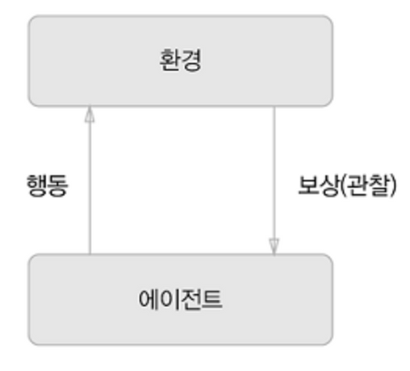

책에서는 딥러닝을 사용한 강화학습 중 DQN을 소개한다. 비디오 게임을 자율 학습시켜 사람을 뛰어넘는 수준의 조작을 실현했다고 한다. 2016년에 바둑 챔피언 이세돌을 이긴 알파고에도 딥러닝과 강화학습이 이용됐고, chatGPT에 사용된 RLHF 역시 강화학습을 이용한 학습 방법이다.

 