# word2vec

## Summary
- 통계 기반 기법의 문제점으로 인하여 추론 기반 기법을 사용한다.
- 추론 기반 기법으로 CBOW 모델과 skip-gram 모델을 이용할수 있다.
- 추론 기반 기법과 통계 기반 기법을 융합한 GloVe 기법도 등장했다.

## 추론 기반 기법과 신경망

### 통계 기반 기법의 문제점
차원 축소를 위해서 PPMI를 만들어야 하고 PPMI 행렬의 크기는 대규모 말뭉치에 있는 단어 갯수에 비례함. <br>
만약 어휘가 100만개라면 `100만 x 100만` 크기의 행렬을 만들게 되고 해당 행렬에 SVD를 적용해야 하는데 이는 매우 많은 연산량을 발생한다.

#### 해결 방법
학습 데이터 전체를 한번에 처리하는 통계 기반 기법과는 달리 작은 학습 데이터를 순차적으로 학습하는 미니배치 방식을 이용하는 `추론 기반 기법` 활용한다. <br>
여러 GPU를 이용한 병렬 계산을 통해 학습 속도를 높일수 있으므로 통계 기반 기법을 사용할 때보다 빠른 학습이 가능하다.

### 추론 기반 기법 개요
주변 단어(context)가 주어졌을때 이를 활용해서 찾고자하는 위치에 어떤 단어가 올지 추론 하는 기법을 말함. <br>
모델은 맥락 정보를 입력받아 (출현할 수 있는) 각 단어의 출현 확률을 출력함.

### 신경망에서의 단어 처리
신경망은 you, say와 같은 단어들은 그대로 입력할 수 없으므로, 숫자를 입력받아 연산을 해야한다. <br>
그로인해 각 단어들을 one-hot 표현으로 변환하여 고정길이 벡터로 만든다.

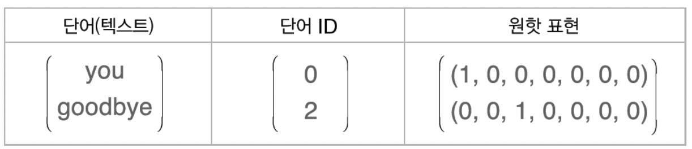

> 단어는 텍스트, 단어 ID, 원핫 표현 형태로 나타낼 수 있음.

#### 단어를 one-hot 표현으로 변환하는 방법
총 어휘 수만큼의 원소를 갖는 벡터에 인덱스가 단어 ID 와 같은 원소를 1로 하고 나머지는 모두 0으로 설정하면 됨. <br>
이처럼 단어를 고정 길이 벡터로 변환하면 신경망의 입력층은 뉴런의 수를 `고정`할 수 있음.

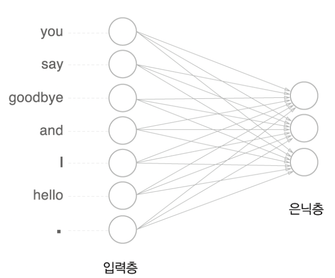

완전 연결 계층으로 표현한 모습

```python
import numpy as np

c = np.array([[1, 0, 0, 0, 0, 0, 0]])
W = np.random.randn(7, 3)
layer = MatMul(W) # 편향을 이용하지 않은 완전연결계층은 행렬 곱 계산에 해당 됨.
h = layer.forward(c)
print(h)

# [[ 0.70012195  0.25204755 -0.79774592]]
```

## 단순한 word2vec
CBOW(continuous bag-of-words) 모델을 이용하여 word2vec 신경망을 만들어보자.

### CBOW 모델의 추론 처리
맥락으로부터 타깃을 추측하는 용도의 신경망이다.

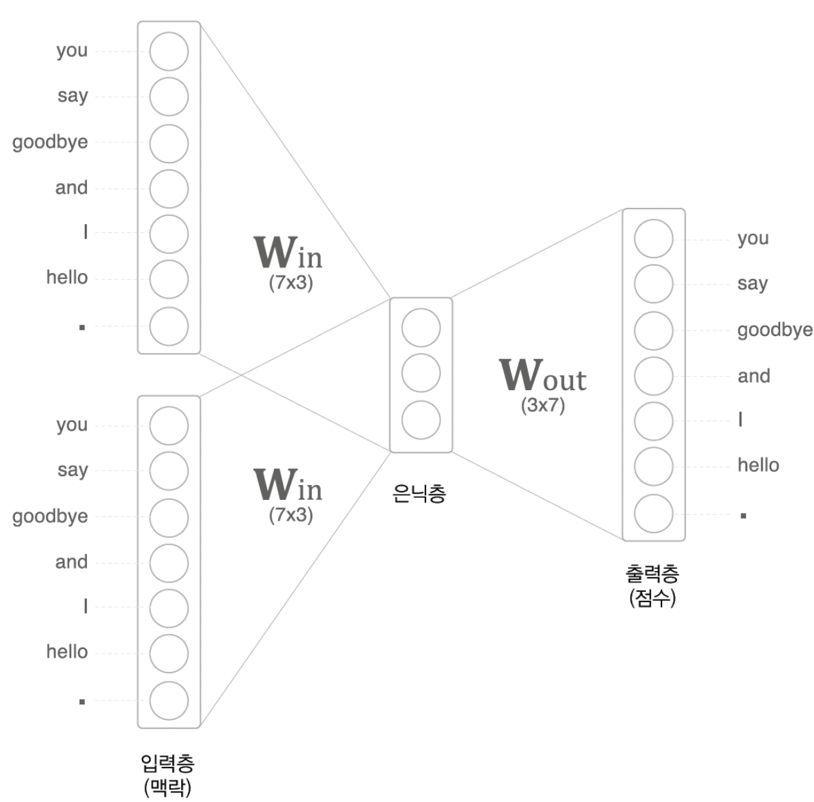

모델의 입력은 맥락이며 입력층이 2개인 이유는 맥락으로 고려할 단어를 2개로 정했기 때문이다. <br>
맥락에 포함시킬 단어가 N개라면 입력층도 N개가 된다. <br>
은닉층의 뉴런은 입력층의 완전연결계층에 의해 변환된 값이 되는데, 입력층이 여러 개이면 전체를 `평균`하면 된다. <br>
출력층 뉴런은 각 단어의 `점수`를 뜻하며, 값이 높을수록 대응 단어의 출현 확률도 높아지고, 이 점수에 소프트맥스 함수를 적용해서 확률을 얻을 수 있다. <br>

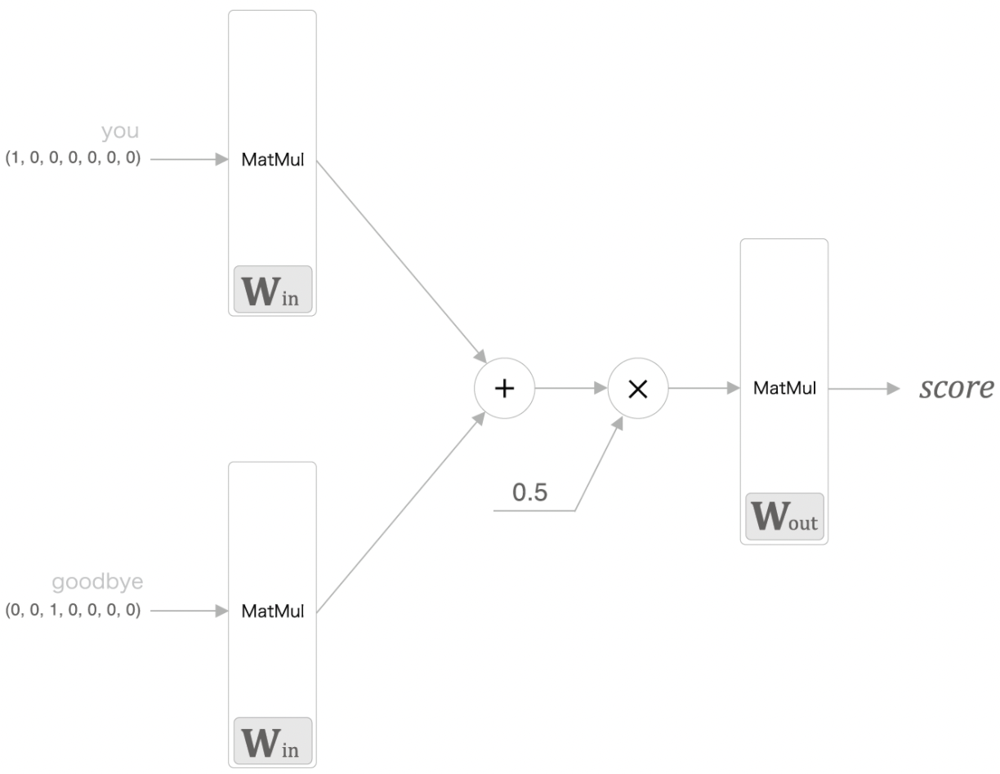

#### CBOW 모델의 추론 과정
```python
# 샘플 맥락 데이터
c0 = np.array([[1, 0, 0, 0, 0, 0, 0]])
c1 = np.array([[0, 0, 1, 0, 0, 0, 0]])

# 가중치 초기화
W_in = np.random.randn(7, 3)
W_out = np.random.randn(3, 7)

# 계층 생성
in_layer0 = MatMul(W_in)
in_layer1 = MatMul(W_in)
out_layer = MatMul(W_out)

# 순전파
h0 = in_layer0.forward(c0)
h1 = in_layer1.forward(c1)
h = 0.5 * (h0 + h1)
s = out_layer.forward(h)

print(s)
```

### CBOW 모델의 학습

해당 모델은 다중 클래스 분류를 수행하는 신경망이므로 소프트맥스 함수와 교차 엔트로피 오차만 이용하면 된다.

소프트맥스를 이용해 점수를 확률로 변환하고, 그 확률과 정답 레이블로부터 교차 엔트로피 오차를 구한 후, 그 값을 손실로 사용해 학습을 진행한다.

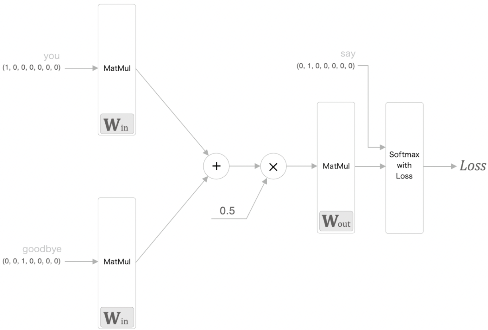

추론 처리를 수행하는 CBOW 모델에 Softmax 계층과 Cross Entropy 계층을 추가한 것만으로도 손실을 얻을 수 있다.

### word2vec 의 가중치와 분산 표현

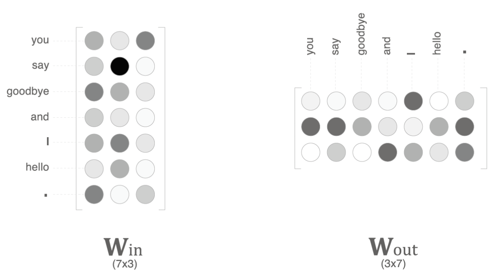

word2vec 에서 사용되는 신경망에는 `입력 측 완전연결계층의 가중치`와 `출력 측 완전연결계층의 가중치` 두 가지 가중치가 있다. <br>
그리고 입력 측 가중치의 각 행이 각 단어의 분산 표현에 해당한다. <br>
다만, 출력 측 가중치는 각 단어의 분산 표현이 열 방향(수직 방향)으로 저장된다.

최종적으로 이용하는 단어의 분산 표현으로 세 가지 방법의 가중치를 선택할 수 있다. 

- 입력 측의 가중치만 이용 
- 출력 측의 가중치만 이용
- 양쪽 가중치를 모두 이용

word2vec(특히 skip-gram 모델)에서는 입력 측 가중치만 이용하는 것이 가장 대중적인 선택이다.

## 학습 데이터 준비
### 맥락과 타깃

말뭉치에서 맥락과 타깃을 만드는 방법

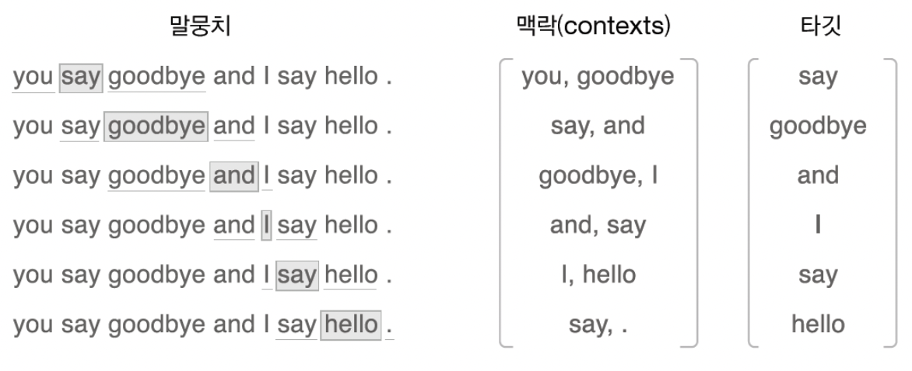

신경망에 맥락을 입력했을 때 타깃이 출현할 확률이 높아지도록 학습을 하는것이 목표이다.


## CBOW 모델 구현
```python
class SimpleCBOW:
    def __init__(self, vocab_size, hidden_size):
        V, H = vocab_size, hidden_size

        # 가중치 초기화
        W_in = 0.01 * np.random.randn(V, H).astype('f')
        W_out = 0.01 * np.random.randn(H, V).astype('f')

        # 계층 생성
        self.in_layer0 = MatMul(W_in)
        self.in_layer1 = MatMul(W_in)
        self.out_layer = MatMul(W_out)
        self.loss_layer = SoftmaxWithLoss()

        # 모든 가중치와 기울기를 리스트에 모은다.
        layers = [self.in_layer0, self.in_layer1, self.out_layer]
        self.params, self.grads = [], []
        for layer in layers:
            self.params += layer.params
            self.grads += layer.grads

        # 인스턴스 변수에 단어의 분산 표현을 저장한다.
        self.word_vecs = W_in
```

```python
# 순전파
    def forward(self, contexts, target):
        h0 = self.in_layer0.forward(contexts[:, 0])
        h1 = self.in_layer1.forward(contexts[:, 1])
        h = (h0 + h1) * 0.5
        score = self.out_layer.forward(h)
        loss = self.loss_layer.forward(score, target)
        return loss
```
```python
# 역전파
    def backward(self, dout=1):
        ds = self.loss_layer.backward(dout)
        da = self.out_layer.backward(ds)
        da *= 0.5
        self.in_layer1.backward(da)
        self.in_layer0.backward(da)
        return None
```

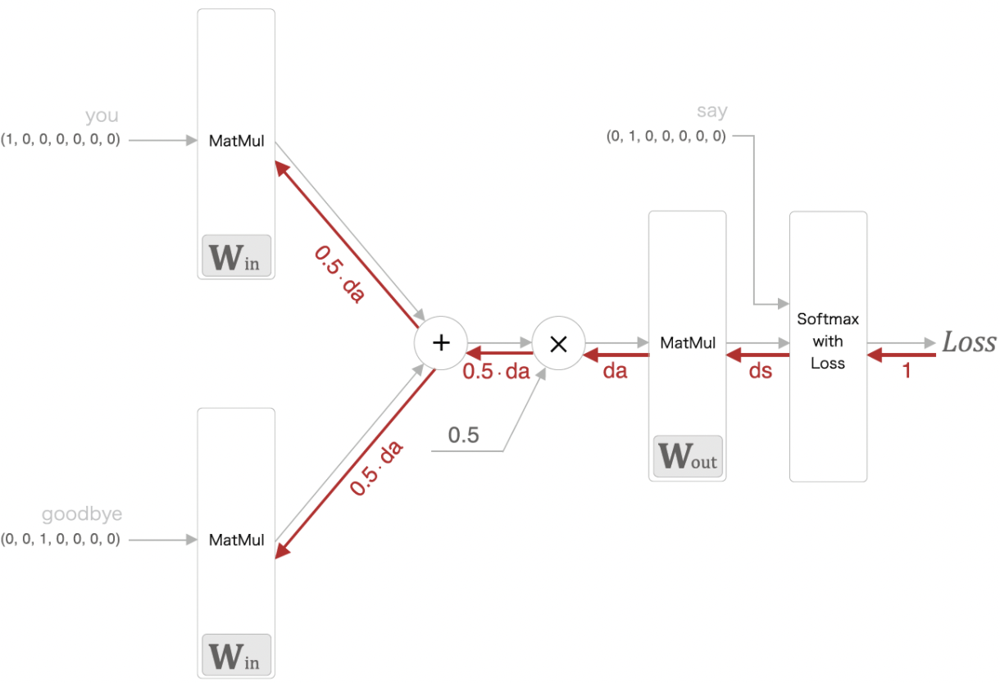

## word2vec 보충
### CBOW 모델과 확률
- P(A,B): 동시 확률로써 A와 B가 동시에 일어날 확률.
- P(A|B): 사후 확률로써 사건이 일어난 후의 확률. B라는 정보가 주어졌을 때, A가 일어날 확률.

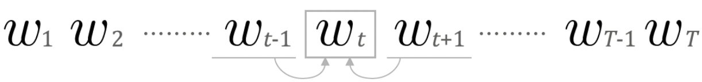

타겟이 w_t가 될 확률


cross entropy를 적용
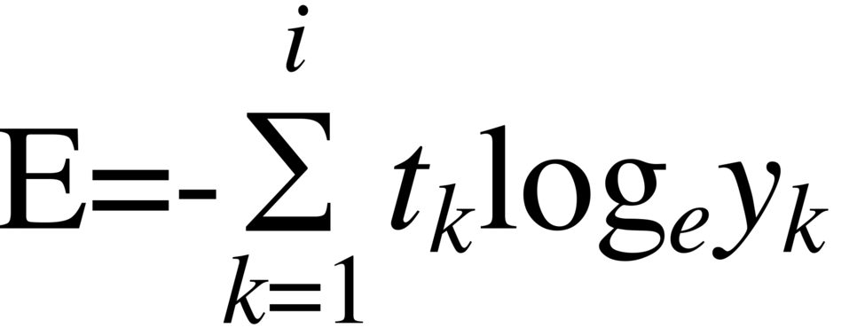

정답 레이블은 one-hot 벡터 형태이므로 w_t에 해당하는 원소만 1이고 나머지는 0이므로 다음과 같은 수식이 만들어진다. <br>
이 수식을 `음의 로그 가능도 (negative log likelihood)` 라고 한다.


위 식은 샘플 데이터 하나에 대한 손실 함수이며, 이를 말뭉치 전체로 확장하면 다음 식이 된다.


### skip-gram 모델


CBOW 모델은 주위 contexts를 통해 target을 추론한다.

반대로 skip-gram 모델은 특정 단어로부터 주변 단어를 추론한다.

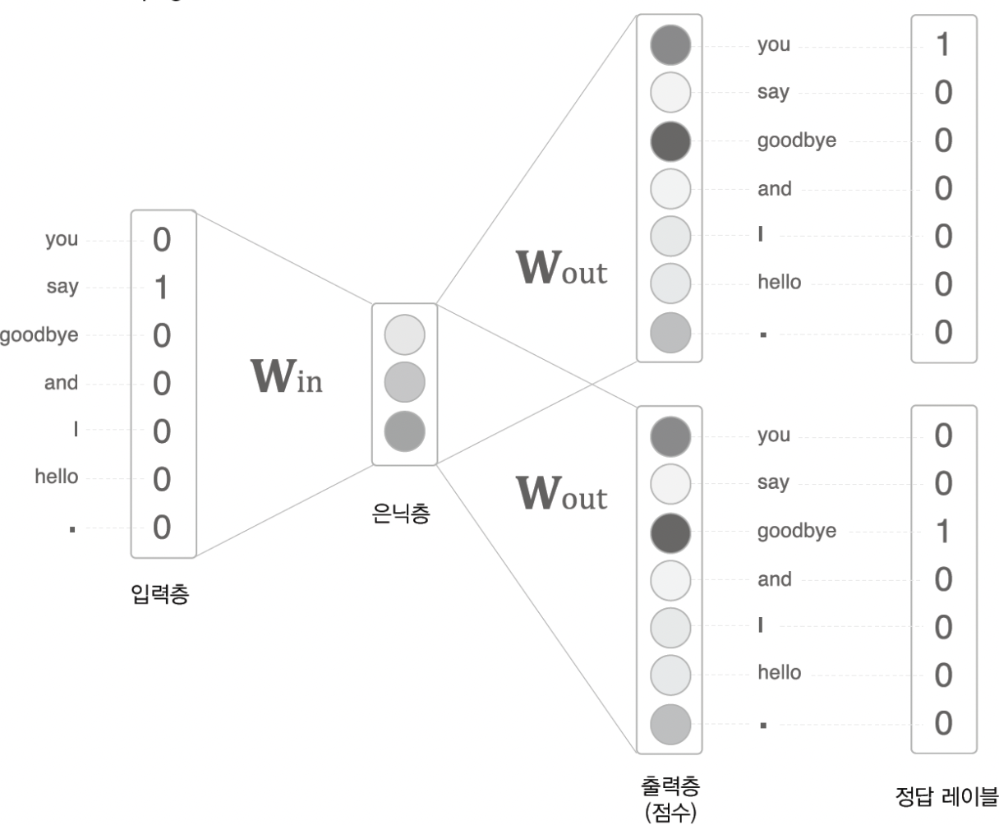

skip-gram 모델의 확률 표기


skip-gram 모델에서는 맥락의 단어들 사이에 관련성이 없다고 가정하고, 다음과 같이 분해한다. (조건부 독립)


교차 엔트로피 오차에 적용하여 skip-gram 모델의 손실 함수를 유도할 수 있다


이를 말뭉치 전체로 확장하면 다음 식이 된다.


skip-gram 모델은 맥락의 수만큼 추측하기 때문에, 그 손실 함수는 각 맥락에서 구한 손실의 총합이어야 한다. <br>
반면, CBOW 모델은 타깃 하나의 손실을 구한다.

### CBOW 모델 vs skip-gram 모델
skip-gram은 단어 분산 표현의 정밀도 면에서 더 우수하므로 skip-gram을 사용하는 것이 더 좋다. <br>
하지만 손실을 맥락의 수만큼 구해야 해서 계산 비용이 커지기 때문에 학습 속도 면에서는 CBOW 모델이 더 좋다.


## 통계 기반 vs. 추론 기반

통계 기반 기법에서는 주로 단어의 유사성이 인코딩되는 반면, <br>
word2vec, skip-gram 모델에서는 단어의 유사성과 한층 복잡한 단어 사이의 패턴까지도 파악되어 인코딩된다.

추론 기반 기법이 통계 기반 기법보다 정확하다고 오해하지만 단어의 유사성을 정량 평가해본 결과, 추론 기반과 통계 기반 기법의 우열을 가릴 수 없었다.

skip-gram 모델과 네거티브 샘플링을 이용한 모델은 모두 말뭉치 전체의 동시발생 행렬에 특수한 행렬 분해를 적용한 것과 같다. <br> 
때문에 특정 조건 하에서 두 기법은 연결되어 있다고 할 수 있다.

나아가 추론 기반 기법과 통계 기반 기법을 융합한 GloVe 기법도 등장했다. <br>
기본 아이디어는 말뭉치 전체의 통계 정보를 손실 함수에 도입해 미니배치 학습하는것이다.
